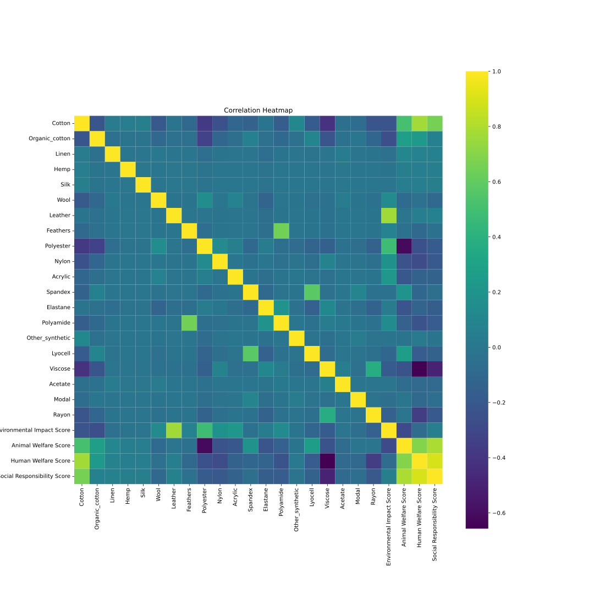
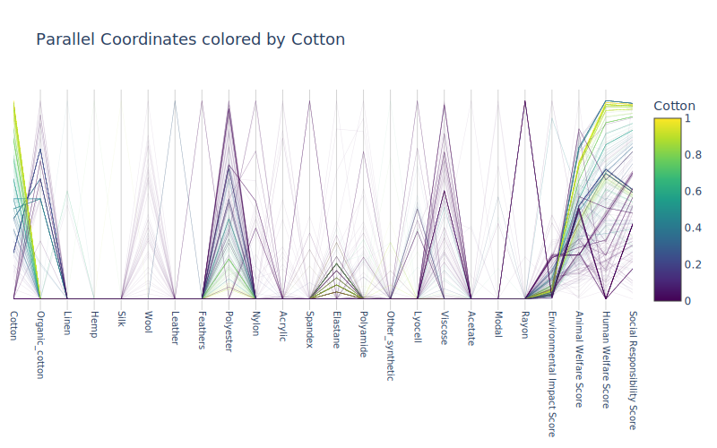
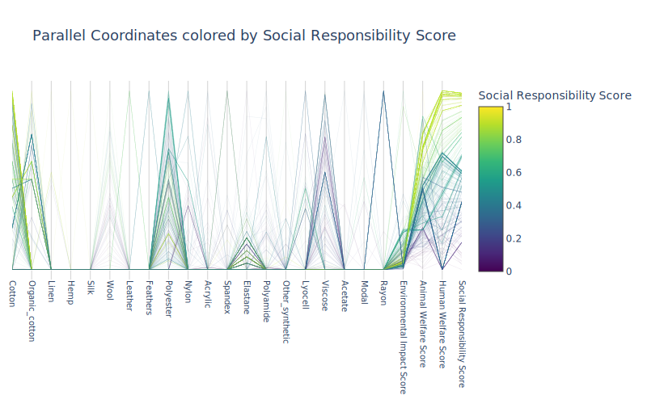
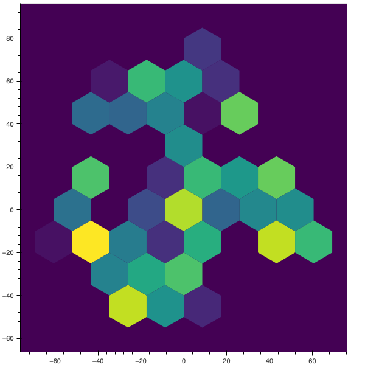
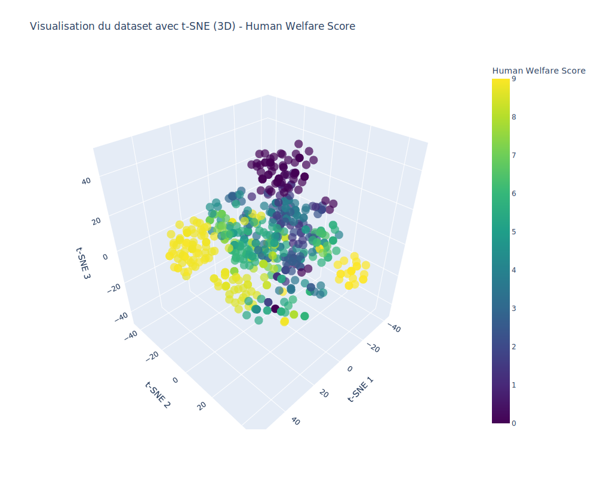
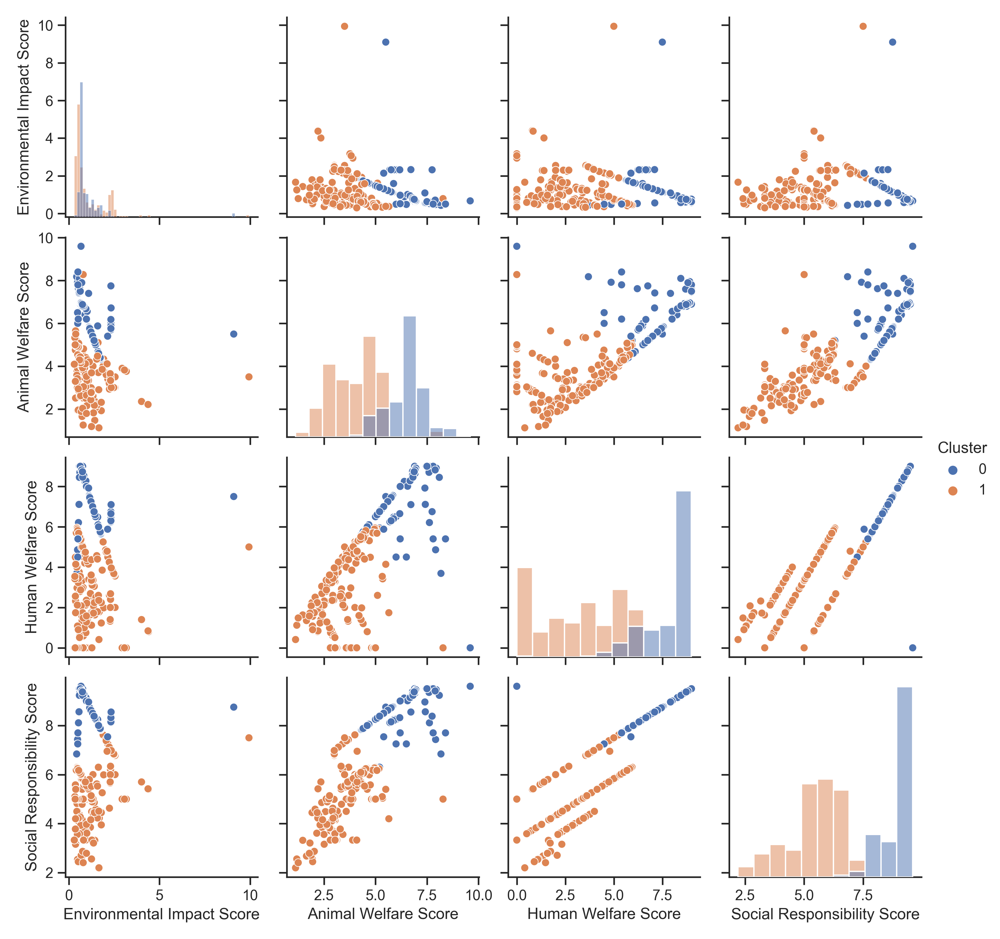
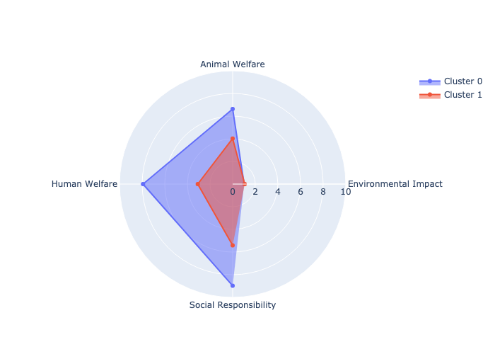
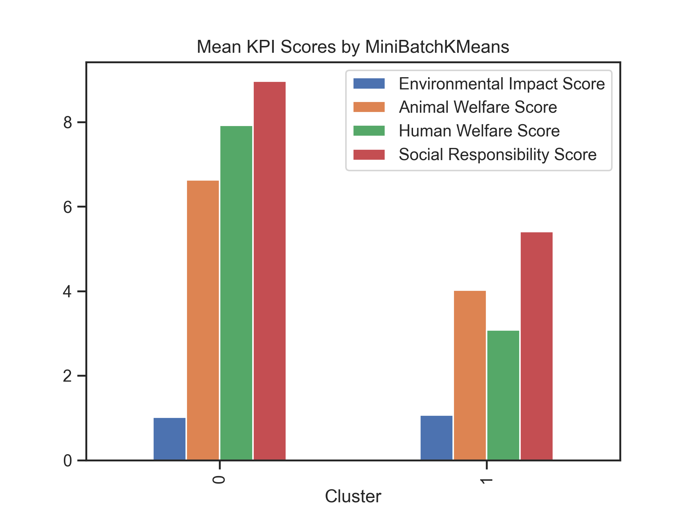

# Préface

Bienvenue dans ce projet ! Ce projet est entièrement libre d'utilisation.

 Ce projet est conçu pour être exécuté dans un environnement **Jupyter Notebook** sous **Python 3.11**.

Afin de garantir la compatibilité des dépendances et de faciliter la gestion des paquets, il est fortement recommandé d'utiliser un environnement virtuel pour installer et gérer les dépendances requises pour ce projet. L'utilisation d'un environnement virtuel permet de garder votre installation Python globale propre et exempte de conflits de dépendances.

Pour commencer à utiliser ce projet et installer les dépendances requises, suivez les étapes ci-dessous :

1. Clonez ou téléchargez ce dépôt sur votre machine locale.
2. Créez un nouvel environnement virtuel en utilisant `python -m venv venv` dans le répertoire du projet.
3. Activez l'environnement virtuel :
   - Sur Windows : `venv\Scripts\activate`
   - Sur macOS/Linux : `source venv/bin/activate`
4. Installez les dépendances requises en utilisant le fichier `requirements.txt` fourni avec la commande suivante : `pip install -r requirements.txt`.
5. Lancez Jupyter Notebook avec la commande `jupyter notebook` et naviguez jusqu'au fichier `.ipynb` que vous souhaitez exécuter.

N'hésitez pas à partager, modifier ou contribuer à ce projet. Bonne exploration !


# Résumé des documents utilisés pour la collecte des données sur l'impact des matières: #

- "Environmental impacts of textile production and use" de T.E. Graedel et al. (2009) examine l'impact environnemental global de la production et de l'utilisation de textiles en examinant les différents stades du cycle de vie, tels que la production de matières premières, la fabrication, la distribution, l'utilisation et l'élimination des textiles.

- "Environmental performance of textile fibres using life cycle assessment" de S. Azadi et al. (2014) utilise une méthode d'analyse du cycle de vie pour évaluer les impacts environnementaux des fibres textiles, notamment en ce qui concerne l'énergie, les émissions de gaz à effet de serre et la consommation d'eau.

- "Sustainability in the textile industry" de K. Mishra et K. Jha (2019) explore les défis et les opportunités de durabilité dans l'industrie textile, notamment en matière de gestion des déchets, d'utilisation de matériaux durables et de respect des normes sociales et environnementales.

- "Sustainability in the Textile and Fashion Industry" de Subramanian Senthilkannan Muthu (2017) examine les impacts environnementaux et sociaux de l'industrie textile et de la mode, ainsi que les mesures que les vêtements peuvent prendre pour améliorer leur performance en matière de durabilité.

- La base de données Higg Materials Sustainability Index (MSI) est un outil d'évaluation de la durabilité des matériaux utilisés dans l'industrie textile, en se concentrant sur des critères tels que l'impact sur l'eau, l'énergie et les émissions de gaz à effet de serre.

- Le rapport de marché des fibres et matériaux préférés de Textile Exchange (2019) fournit des données sur les tendances de durabilité dans l'industrie textile, notamment en ce qui concerne l'utilisation de matériaux durables tels que le coton biologique et le polyester recyclé.

# Justification des choix des KPI : #

- Le `env_score` est calculé en utilisant quatre mesures d'impact environnemental : l'utilisation de l'eau, l'énergie fossile consommée, les émissions de gaz à effet de serre et l'utilisation des terres. Ces mesures sont utilisées pour évaluer la quantité d'eau, d'énergie et de ressources terrestres utilisées pour produire une unité de textile, ainsi que les émissions de gaz à effet de serre associées.

    <ins>Calcule</ins>: `(impact_data['Water_Use_kg/kg'] + impact_data['Fossil_Energy_kg/kg'] + impact_data['Greenhouse_Gas_kgCO2eq/kg'] + impact_data['Land_use_m2/kg']) / 4`

    Plus le score est faible, moins l'impact est negatif.

- Le `animal_score` est une mesure de bien-être animal, qui est utilisée pour évaluer les conditions dans lesquelles les animaux sont élevés et traités dans le cadre de la production de textiles. Cette mesure prend en compte les normes de bien-être animal, telles que l'espace disponible, les conditions de vie et les traitements inhumains.

    <ins>Calcule</ins>: `impact_data['Animal_Welfare_Score']`
    
    Plus le score est élevé, moins l'impact est negatif.

- Le `human_score` est une mesure de bien-être humain, qui est utilisée pour évaluer les conditions de travail et les droits de l'homme dans l'industrie textile. Cette mesure prend en compte les salaires, les heures de travail, les normes de sécurité et les droits des travailleurs.

    <ins>Calcule</ins>: `impact_data['Human_Welfare_Score']`

    Plus le score est élevé, moins l'impact est negatif.

- Le `social_score` est une mesure globale de l'impact social de la production de textiles, qui prend en compte les conditions de travail, les droits des travailleurs, la sécurité et d'autres facteurs sociaux. Cette mesure est basée sur une combinaison du `labor_score` et du `human_score`, en ajoutant également une pénalité si des conditions de travail dangereuses ou inhumaines ont été identifiées.

    <ins>Calcule</ins>: `(1 if impact_data['Labor_Conditions'].eq("unsafe").any() else 10 + 
                    impact_data['Human_Welfare_Score']) / 2`

    Plus le score est élevé, moins l'impact est negatif.

Les KPI sont normalisé afin de pouvoir les comparer entre eux et de ne pas perturbé les modeles nn supervisé qui tourneront sur les données.

`valeur_normalisée = valeur_min_nouvelle_plage + ((valeur - valeur_min_ancienne_plage) * (valeur_max_nouvelle_plage - valeur_min_nouvelle_plage)) / (valeur_max_ancienne_plage - valeur_min_ancienne_plage)`

Cette formule permet de transformer une valeur dans l'ancienne plage de valeurs en une valeur équivalente dans la nouvelle plage. Les minimums et maximums des plages de valeurs pour chaque KPI doivent être définis en fonction des données.


# Justification du NLP : #

L'utilisation de la partie NLP permet de traiter de manière automatisée des entrées non structurées et de les convertir en une forme standardisée pour faciliter l'analyse des données. Dans ce cas précis, cela permet d'éviter les erreurs de frappe, les variations de noms et autres incohérences qui pourraient rendre difficile l'analyse des impacts environnementaux.

L'algorithme utilise la similitude cosinus pour trouver le nom générique le plus proche du nom de matériau brut donné en entrée. Il compare la similitude de chaque nom de matériau dans le jeu de données avec le texte d'entrée prétraité à l'aide du modèle NLP chargé. Le nom de matériau ayant la similitude la plus élevée avec l'entrée est choisi comme nom générique.

Un moteur NLP a été mis en place afin de faciliter le travail de netoyage des données entre les dataset. Il permet de convertire automatiquement des noms en des noms generique. Par exemple, si le nom d'un materiau est "cotton", le moteur NLP va le convertire en "Cotton" et si le nom d'un materiau est "Cotton 100%  naturel", le moteur NLP va le convertire en "Cotton_Organique". Cela permet de faciliter le travail de netoyage des données et de rendre les données plus homogène.

# Zoom sur les colonnes du dataset impacts #

Le dataset `impacts` a été cree a la main a partire des reference cité ci-dessus. 
Voici une description des différentes colonnes disponibles dans le dataset impacts :

- `Material` : Le nom du matériau utilisé pour fabriquer le textile.
- `Organic` : Une valeur booléenne (0 ou 1) indiquant si le matériau est cultivé de manière biologique.
- `Water_Use_kg/kg` : La quantité d'eau utilisée en kilogrammes pour produire un kilogramme de matériau.
- `Fossil_Energy_kg/kg` : La quantité d'énergie fossile utilisée en kilogrammes pour produire un kilogramme de matériau.
- `Greenhouse_Gas_kgCO2eq/kg` : Le nombre de kilogrammes d'équivalent CO2 émis pour produire un kilogramme de matériau, mesuré en termes d'effet de serre.
- `Land_use_m2/kg` : La quantité de terre utilisée en mètres carrés pour produire un kilogramme de matériau.
- `Animal_Welfare_Score` : Une note sur 10 indiquant le bien-être animal lors de la production du matériau (pour les matières d'origine animale).
- `Human_Welfare_Score` : Une note sur 10 indiquant les conditions de travail des travailleurs impliqués dans la production du matériau.
- `Country_of_Origin` : Le pays d'origine du matériau.
- `Production_Method` : La méthode de production utilisée pour fabriquer le matériau.
- `Transport_Distance_km` : La distance parcourue en kilomètres pour transporter le matériau jusqu'à l'usine de production du textile.
- `Water_Source` : La source d'eau utilisée dans la production du matériau (p. ex. eau souterraine, eau de surface).
- `Dyeing_Method` : La méthode de teinture utilisée pour le matériau.
- `Packaging_Material` : Le matériau utilisé pour emballer le matériau lors de l'expédition.
- `Waste_Management` : La méthode de gestion des déchets utilisée pour les déchets de production.
- `Labor_Conditions` : Les conditions de travail des travailleurs impliqués dans la production du matériau.


# Annalyse appronfondie du dataset
Maintenat que nous avont des KPI coherant et que vous avont bien compris nos données grace a la V0 il est temps de rentré dans le detail afin de verifier que le datase est pret a la modelisation et d'essayer de trouvé des modeles coherent avec nos donnée.

Avant de visualisé ce dataset, il faut savoire qu'il a une tres forte dimentionalité (nombre de variables/colones) ce qui rend plus difficila ca comprehension.
Afin de paller a ce probleme, nous avont plusieur solution, la premieres et d'utilisé des graphique addapté telle que la visualisation en `coordonees parralelle` ou des `matrice de correlation` qui permet de suivre l'evolution de nos variable et utilisé des technique de reduction dimentionels. Nous allon faire les deux.

- `Matrice de correlation`:
    
    
    
    On remarque directement que certaine variable sont corréle. Notament le `Cotton` qui est en lien directe avec avec nos nos KPI "social". On remarque aussi un corrélation assez élevé entre nos KPIs, ce qui est logique car ils reflete tous diferente aspect d'une meme chose. Cependant leures correlation est suffisament faible pour que nous puissions les utilisé ensemble.

- `parallel coordinates`:
    
    
    
    En annalysant ce graphique on remarque plusieurs choses, notament que cetaine varible n'ont pas trop d'importence comme `Hemp` et on remaque aussi qu'un `Cotton` elevé tend a des KPIs elevé.

    
    On peux aussi regarder le graphique colorié en fonction de nos KPIs, par exemple, si on regarde pour `social Responsibility Score`:

    

    
    On remaque que les vetements comportant un fort taux de `Viscose` ont un `social Responsibility Score` faible. Ce qui est logique car la viscose est matière chimique artificielle fabriquée à base de bois gras réduit en copeaux ou de pâte de bois trempé dans de la soude. Donc ayant un impact social important car les condition de travail avec de tell matieres sont mauvaise.

    Vous trouverais les graphique pour chaque variables dans le dossier `images/parallel` de ce repo.

- `2D_TSNE`:

    Le `t-SNE` est une technique de réduction de dimensionnalité non linéaire qui est particulièrement adaptée à la visualisation de données de haute dimension. Il est particulièrement utile pour visualiser des données de haute dimension dans un espace à deux dimensions, ce qui permet de les visualiser et de les analyser. Il est également utilisé pour la visualisation de données de haute dimension dans un espace à trois dimensions.

    Ici, nous avont donc utilisé le `t-SNE` afin de reduire nos données a 2 dimensions afin de les visualisé facilement dans leurs globalité.

    
    
    Nous observont sur ce graphique nos données reduite a 2 dimention colorié en fonction de la dencié par regions.

    En annalysant, nous avont l'impression de voire 2 ou 3 cluster entremelé. Il est difficile de faire une conclusion avancé avec ce grahique a par que nos données semble assez centré avec cependent des `Points fort` a certain endroit.

    Afin de s'en assuré nous alons ajouté une dimention afin de pouvoir voire ce qui ce cache sous cette fameuse `densité`.

- `3D_TSNE`:

    

    Ce graphique represente nos données reduite a 3 dimention colorié en fonction de notre KPI `Human Welfare Score`.

    Evidenment cette image est une projection 2D de la visualisation 3D que j'ai. J'ai donc facilement pu faire tourner la visualisation 3D afin de voir les données sous un autre angle et remarqué tres clairement une mutitude de petit cluster assez proche les un des autres. Cela nous permet de confirmer que nos données sont pretes a etre modelisé.

    En effet, ceci nous montre que nos KPI sont representatif de certaine sructure interne a nos donnée

    Vous pouvez trouver les graphique 3D dans le dossier `images/DataSet/TSNE` de ce repo avec le prefix `3D_TSNE_`.

# Modelisation des données 
Maintenant que nous somme pret a modelisé nos données, nous allons selectionné les modeles que nous voulons essayer.
Au vus de nos données, je vais utilsé des algorythmes non supermisé (clustering) car mes données ne sont pas liblé.
J'ai donc selectionnée les modeles suivant:
Bien sûr, voici une explication améliorée pour chaque algorithme :

- `KMeans` :
K-means est un algorithme de clustering populaire et simple qui vise à partitionner un ensemble de données en K groupes distincts (clusters) de manière non supervisée. L'algorithme attribue chaque point de données au cluster dont le centre (moyenne) est le plus proche. Il fonctionne en alternant deux étapes principales : l'attribution des points aux clusters et la mise à jour des centres des clusters. K-means est largement utilisé en raison de sa simplicité, de sa rapidité et de sa facilité d'interprétation. Cependant, il est sensible au choix initial des centres et peut parfois converger vers des solutions sous-optimales.

- `AgglomerativeClustering` :
L'algorithme de clustering agglomératif est un algorithme de clustering hiérarchique qui construit un arbre de clusters en fusionnant progressivement les clusters les plus proches. Il commence en considérant chaque point comme un cluster individuel, puis fusionne les deux clusters les plus proches, répétant cette opération jusqu'à ce qu'un seul cluster reste. La distance entre les clusters peut être calculée de différentes manières, telles que la distance de Ward, le maximum, la moyenne, le single ou le complet. Le clustering agglomératif est particulièrement utile pour les données avec une structure hiérarchique, mais peut être lent pour les grands ensembles de données.

- `SpectralClustering` :
Le clustering spectral est un algorithme de clustering non supervisé qui utilise les propriétés spectrales (eigenvectors) de la matrice de similarité des données pour effectuer une réduction de dimensionnalité avant de regrouper les données. Il est souvent utilisé pour des données ayant une structure complexe ou des groupes non convexes. L'algorithme est basé sur la théorie des graphes et la théorie spectrale, et utilise généralement des techniques de réduction de dimensionnalité comme l'analyse en composantes principales (PCA) avant d'appliquer un algorithme de clustering comme K-means. Il est particulièrement efficace pour la détection de communautés dans les réseaux et les données de grande dimension.

- `Birch` :
L'algorithme BIRCH (Balanced Iterative Reducing and Clustering using Hierarchies) est un algorithme de clustering non supervisé conçu pour traiter efficacement de grands ensembles de données. Il construit un arbre de clustering équilibré et hiérarchique (CF-Tree) en utilisant des caractéristiques de résumé pour chaque cluster, ce qui permet une réduction significative du temps de calcul. BIRCH est capable de traiter des données volumineuses tout en conservant une bonne qualité de clustering, mais il est surtout adapté aux données ayant une structure globale et une densité uniforme.

- `MiniBatchKMeans` :
Mini Batch K-means est une variante de l'algorithme K-means qui utilise des mini-lots (sous-ensembles de données) pour réduire le temps de calcul. Au lieu de mettre à jour les centres des clusters en utilisant tous les points de données à chaque itération, Mini Batch K-means met à jour les centres en utilisant un sous-ensemble aléatoire de points, ce qui accélère considérablement l'algorithme sans sacrifier de manière significative la qualité du clustering. Mini Batch K-means est particulièrement adapté aux grands ensembles de données et offre un compromis intéressant entre temps de calcul et qualité de clustering.

- `SpectralBiclustering` :
Le biclustering spectral est un algorithme de clustering non supervisé qui permet de regrouper simultanément les lignes et les colonnes d'une matrice de données. Il est basé sur la théorie des graphes et la théorie spectrale et combine des techniques de réduction de dimensionnalité, telles que l'analyse en composantes principales (PCA) et l'analyse en composantes indépendantes (ICA), avec des techniques de clustering, comme K-means. Le biclustering spectral est particulièrement utile pour analyser des données non structurées et de grande dimension, ainsi que pour la détection de communautés dans les réseaux.

- `SpectralCoclustering` :
Le coclustering spectral est une variante du biclustering spectral qui vise à regrouper simultanément les lignes et les colonnes d'une matrice de données en utilisant les propriétés spectrales de la matrice. Il combine également des techniques de réduction de dimensionnalité, telles que l'analyse en composantes principales (PCA) et l'analyse en composantes indépendantes (ICA), avec des techniques de clustering, comme K-means. Le coclustering spectral est adapté pour analyser des données non structurées et de grande dimension, ainsi que pour la détection de communautés dans les réseaux.

Afin de trouver les meilleurs modèles et les meilleurs paramètres de ces modèles pour mes données, j'ai choisi d'utiliser la méthode `Random Search`. Ce projet étant à but éducatif, j'ai également fait le choix d'implémenter moi-même cette méthode. Cette approche consiste à sélectionner aléatoirement des combinaisons de paramètres pour chaque modèle et à évaluer leurs performances. Cela permet d'explorer l'espace des paramètres de manière plus efficace que les méthodes de recherche exhaustive, tout en offrant une bonne couverture des différentes possibilités. Ainsi, j'ai pu identifier les modèles les plus adaptés à mes données et les ajuster pour obtenir les meilleures performances possibles.

Voici les meilleurs paramètres du meilleur modèle trouvé par `Random Search` :

| Algorithme     | Score         | batch_size | init      | max_iter | n_clusters | tol    |
| -------------- | ------------- | ---------- | --------- | -------- | ---------- | ------ |
| MiniBatchKMeans | 0.5350511543312847 | 10         | k-means++ | 200      | 2          | 1e-05 |

Maintenant, il suffit d'implémenter et d'inférer ce modèle sur nos données afin de pouvoir visualiser à quoi il correspond.

- **PairPlot** :

    

    On se rend compte que les deux clusters sont séparés mais qu'ils se chevauchent un peu. Outre cela, on remarque que le `cluster 0` correspond à des valeurs plus élevées que le `cluster 1`.

- **Radar** :

    

    Le graphique radar confirme que lorsque les KPI dépassent un certain seuil, le clustering labellise les données dans le `cluster 0`.

- **Histogramme** :

    

    Sans surprise, l'histogramme montre à nouveau que le `cluster 0` correspond à des valeurs plus élevées que le `cluster 1`.

# Conclusion
Au cours de ce projet, nous avons constaté que les KPI actuels ne sont pas les plus appropriés. En effet, le `social_score` est fortement corrélé aux autres indicateurs, ce qui limite son apport d'informations pertinentes. De plus, le KPI relatif à l'environnement n'est pas suffisamment sensible, car la grande majorité des valeurs sont inférieures à 1. Cette problématique est mise en évidence lors de l'utilisation de la méthode `describe` de Pandas :

```
| Statistique | Valeur       |
| ----------- | ------------ |
| count       | 718.000000   |
| mean        | 1.047006     |
| std         | 1.005994     |
| min         | 0.300000     |
| 25%         | 0.550000     |
| 50%         | 0.710000     |
| 75%         | 1.250000     |
| max         | 9.940000     |
```

# Perspectives
Pour poursuivre ce projet, il serait judicieux d'envisager de revoir les KPI en premier lieu. Il serait intéressant d'étudier de nouveaux indicateurs et d'analyser leur corrélation avec les autres variables afin d'obtenir des informations plus significatives. De plus, il pourrait être utile d'examiner les méthodes de normalisation ou de transformation des données pour améliorer la sensibilité et la pertinence des KPI existants. Enfin, il serait également pertinent d'explorer d'autres techniques de clustering et d'optimisation des hyperparamètres pour évaluer leur efficacité sur les données améliorées.