# Résumé des documents utilisés pour la collecte des données sur l'impact des matières: #

- "Environmental impacts of textile production and use" de T.E. Graedel et al. (2009) examine l'impact environnemental global de la production et de l'utilisation de textiles en examinant les différents stades du cycle de vie, tels que la production de matières premières, la fabrication, la distribution, l'utilisation et l'élimination des textiles.

- "Environmental performance of textile fibres using life cycle assessment" de S. Azadi et al. (2014) utilise une méthode d'analyse du cycle de vie pour évaluer les impacts environnementaux des fibres textiles, notamment en ce qui concerne l'énergie, les émissions de gaz à effet de serre et la consommation d'eau.

- "Sustainability in the textile industry" de K. Mishra et K. Jha (2019) explore les défis et les opportunités de durabilité dans l'industrie textile, notamment en matière de gestion des déchets, d'utilisation de matériaux durables et de respect des normes sociales et environnementales.

- "Sustainability in the Textile and Fashion Industry" de Subramanian Senthilkannan Muthu (2017) examine les impacts environnementaux et sociaux de l'industrie textile et de la mode, ainsi que les mesures que les vêtements peuvent prendre pour améliorer leur performance en matière de durabilité.

- La base de données Higg Materials Sustainability Index (MSI) est un outil d'évaluation de la durabilité des matériaux utilisés dans l'industrie textile, en se concentrant sur des critères tels que l'impact sur l'eau, l'énergie et les émissions de gaz à effet de serre.

- Le rapport de marché des fibres et matériaux préférés de Textile Exchange (2019) fournit des données sur les tendances de durabilité dans l'industrie textile, notamment en ce qui concerne l'utilisation de matériaux durables tels que le coton biologique et le polyester recyclé.

# Justification des choix des KPI : #

- Le `env_score` est calculé en utilisant quatre mesures d'impact environnemental : l'utilisation de l'eau, l'énergie fossile consommée, les émissions de gaz à effet de serre et l'utilisation des terres. Ces mesures sont utilisées pour évaluer la quantité d'eau, d'énergie et de ressources terrestres utilisées pour produire une unité de textile, ainsi que les émissions de gaz à effet de serre associées.

- Le `animal_score` est une mesure de bien-être animal, qui est utilisée pour évaluer les conditions dans lesquelles les animaux sont élevés et traités dans le cadre de la production de textiles. Cette mesure prend en compte les normes de bien-être animal, telles que l'espace disponible, les conditions de vie et les traitements inhumains.

- Le `human_score` est une mesure de bien-être humain, qui est utilisée pour évaluer les conditions de travail et les droits de l'homme dans l'industrie textile. Cette mesure prend en compte les salaires, les heures de travail, les normes de sécurité et les droits des travailleurs.

- Le `social_score` est une mesure globale de l'impact social de la production de textiles, qui prend en compte les conditions de travail, les droits des travailleurs, la sécurité et d'autres facteurs sociaux. Cette mesure est basée sur une combinaison du `labor_score` et du `human_score`, en ajoutant également une pénalité si des conditions de travail dangereuses ou inhumaines ont été identifiées.

# Justification du NLP : #

L'utilisation de la partie NLP permet de traiter de manière automatisée des entrées non structurées et de les convertir en une forme standardisée pour faciliter l'analyse des données. Dans ce cas précis, cela permet d'éviter les erreurs de frappe, les variations de noms et autres incohérences qui pourraient rendre difficile l'analyse des impacts environnementaux.

L'algorithme utilise la similitude cosinus pour trouver le nom générique le plus proche du nom de matériau brut donné en entrée. Il compare la similitude de chaque nom de matériau dans le jeu de données avec le texte d'entrée prétraité à l'aide du modèle NLP chargé. Le nom de matériau ayant la similitude la plus élevée avec l'entrée est choisi comme nom générique.

Cette approche permet également de réduire la dimensionnalité du problème, en transformant un grand nombre de noms de matériaux différents en un nombre limité de noms génériques, ce qui facilite l'analyse des impacts environnementaux à grande échelle.

# Utilisation du clustering : #

La première étape est de normaliser les données en utilisant `StandardScaler` pour mettre à l'échelle les caractéristiques et les centrer autour de zéro. Cela permet d'éviter que les caractéristiques avec des unités différentes ne soient pondérées de manière disproportionnée dans le processus de clustering.

Ensuite, trois algorithmes de clustering différents sont appliqués aux données normalisées : `KMeans`, `DBSCAN` et `GaussianMixture`. `KMeans` est un algorithme de clustering basé sur la distance qui tente de diviser les données en K groupes de taille égale en minimisant la somme des carrés des distances entre les points et leur centroïde. `DBSCAN` est un algorithme de clustering basé sur la densité qui tente de diviser les données en groupes de densité élevée séparés par des zones de faible densité. Enfin, `GaussianMixture` est un algorithme de clustering basé sur la distribution qui modélise les clusters comme des distributions gaussiennes.

Une fois que les clusters ont été trouvés pour chaque algorithme de clustering, les prédictions sont stockées dans de nouvelles colonnes dans `clothes_df`. Ces colonnes sont appelées `KMeanCluster`, `DbscanCluster` et `GMCluster`, respectivement. Les clusters peuvent ensuite être utilisés pour effectuer des analyses et de la segmentation en deux catégories : les durables et les non durables.

## Focus sur KMeans ##

`KMeans` est un algorithme de regroupement qui vise à répartir les points de données dans un nombre prédéterminé de groupes (`k`) en fonction de leur distance au centroïde de chaque groupe. L'algorithme initialise `k` centroïdes de manière aléatoire et assigne itérativement chaque point de données au centroïde le plus proche, calcule les nouveaux centroïdes sur la base de la moyenne des points de données assignés, et répète l'opération jusqu'à convergence. Par conséquent, `KMeans` affecte les points de données aux groupes en fonction de leur proximité avec le centroïde de chaque groupe, qui est déterminé par les valeurs moyennes des scores KPI pour chaque groupe.

## Focus sur DBSCAN ##

`DBSCAN` est un algorithme de regroupement basé sur la densité qui identifie les groupes en fonction des régions à forte densité séparées par des régions à faible densité. L'algorithme nécessite deux paramètres : epsilon (ε), qui détermine le rayon du voisinage autour de chaque point de données, et minPts, qui détermine le nombre minimum de points de données requis pour former une région dense. L'algorithme commence par un point de données aléatoire et trouve tous ses points voisins à une distance de ε. Si le nombre de points voisins est supérieur ou égal à minPts, un nouveau groupe est formé. Dans le cas contraire, le point de données est qualifié de bruit ou de point frontière et l'algorithme passe au point de données suivant. `DBSCAN` affecte les points de données aux groupes en fonction de leur proximité avec d'autres points de données dans un rayon spécifié, ce qui peut donner lieu à des groupes de forme irrégulière.

## Focus sur le Mélange Gaussien ##
Le Mélange Gaussien est un algorithme de regroupement probabiliste qui modélise la distribution sous-jacente des données comme un mélange de distributions gaussiennes.L'algorithme nécessite la spécification du nombre de composantes (k), qui correspond au nombre de grappes. Il initialise les paramètres de chaque distribution gaussienne de manière aléatoire et les ajuste itérativement pour maximiser la vraisemblance des données observées.Par conséquent, le Mélange Gaussien affecte les points de données aux grappes en fonction de la probabilité d'appartenance à chacune des distributions gaussiennes. Cette probabilité est déterminée par les scores des indicateurs clés de performance.

# Zoom sur les colonnes du dataset impacts #

Voici une description des différentes colonnes disponibles dans le dataset impacts :

- `Material` : Le nom du matériau utilisé pour fabriquer le textile.
- `Organic` : Une valeur booléenne (0 ou 1) indiquant si le matériau est cultivé de manière biologique.
- `Water_Use_kg/kg` : La quantité d'eau utilisée en kilogrammes pour produire un kilogramme de matériau.
- `Fossil_Energy_kg/kg` : La quantité d'énergie fossile utilisée en kilogrammes pour produire un kilogramme de matériau.
- `Greenhouse_Gas_kgCO2eq/kg` : Le nombre de kilogrammes d'équivalent CO2 émis pour produire un kilogramme de matériau, mesuré en termes d'effet de serre.
- `Land_use_m2/kg` : La quantité de terre utilisée en mètres carrés pour produire un kilogramme de matériau.
- `Animal_Welfare_Score` : Une note sur 10 indiquant le bien-être animal lors de la production du matériau (pour les matières d'origine animale).
- `Human_Welfare_Score` : Une note sur 10 indiquant les conditions de travail des travailleurs impliqués dans la production du matériau.
- `Country_of_Origin` : Le pays d'origine du matériau.
- `Production_Method` : La méthode de production utilisée pour fabriquer le matériau.
- `Transport_Distance_km` : La distance parcourue en kilomètres pour transporter le matériau jusqu'à l'usine de production du textile.
- `Water_Source` : La source d'eau utilisée dans la production du matériau (p. ex. eau souterraine, eau de surface).
- `Dyeing_Method` : La méthode de teinture utilisée pour le matériau.
- `Packaging_Material` : Le matériau utilisé pour emballer le matériau lors de l'expédition.
- `Waste_Management` : La méthode de gestion des déchets utilisée pour les déchets de production.
- `Labor_Conditions` : Les conditions de travail des travailleurs impliqués dans la production du matériau.

# Analyse des plots #

## KMean ##

### PairPlot ###

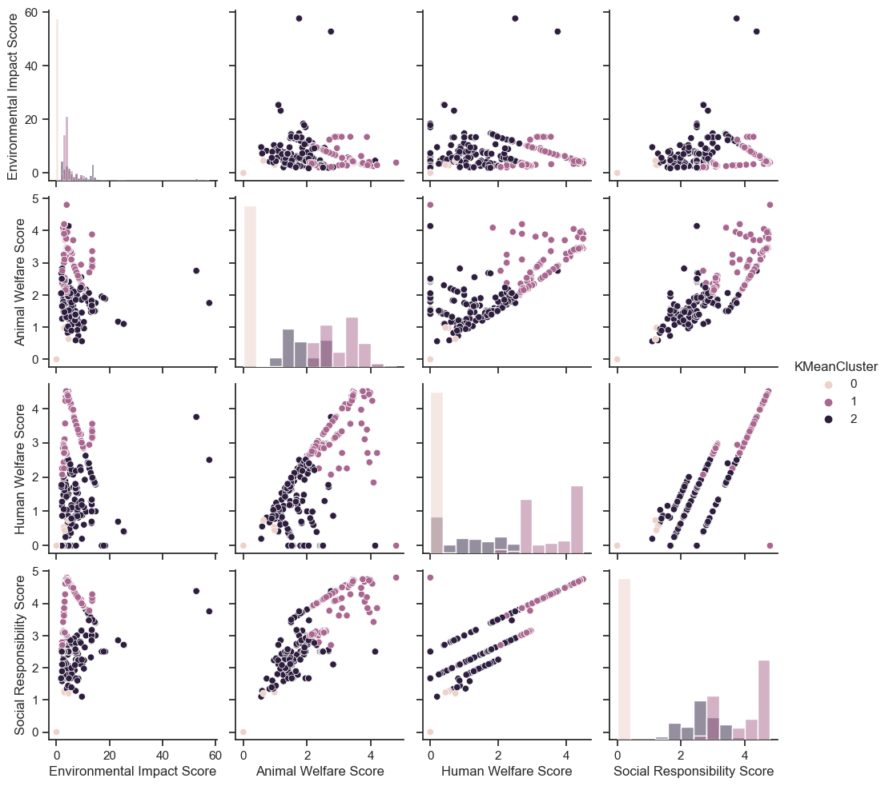

Analyse :

En examinant les données fournies, on peut observer que la majorité des échantillons appartiennent à la classe 1. Cependant, il existe aussi des échantillons qui appartiennent aux classes 2 et 3. Les scores varient selon les classes, ce qui peut indiquer des différences significatives entre les groupes.

Description :

- La classe 1 présente généralement des scores élevés pour les quatre critères : impact environnemental, bien-être animal, bien-être humain et responsabilité sociale.
- La classe 2 présente des scores plus faibles pour ces critères.
- La classe 3 se situe entre les deux en termes de scores.

Conclusion :

D'après l'analyse des données et du graphique en paire, il semble que les classes générées par l'algorithme KMeans soient utiles pour distinguer les différentes catégories de produits en fonction de leurs scores environnementaux et sociaux. Les classes permettent de regrouper les produits ayant des caractéristiques similaires et pourraient aider les consommateurs à faire des choix éclairés en fonction de leurs préférences et de leurs valeurs. Toutefois, il est important de noter que les classes sont fortement déséquilibrées, la majorité des échantillons appartenant à la classe 1. Des analyses supplémentaires pourraient être nécessaires pour déterminer si un regroupement différent ou un nombre différent de classes serait plus approprié.

### Radar ###

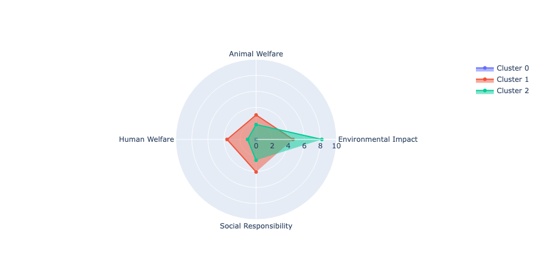

En analysant ce graphique il est évident que la classe 0 ne semble pas contribuer de manière significative à la segmentation des données et qu'il serait donc envisageable de n'utiliser que deux classes. Il convient de noter que cette conclusion ne contredit pas l'analyse précédente et est particulièrement claire sur ce graphique. 

En observant les trois classes créées par le clustering KMeans, on remarque que la classe 0 ne contribue pas de manière significative à la segmentation des données. Par conséquent, il serait envisageable de n'utiliser que deux classes pour la classification.

De plus, il est intéressant de noter que la classe 2 se concentre davantage sur l'impact environnemental. Cela pourrait être dû à un biais dans le KPI, qui peut être lié à des valeurs extrêmes par rapport aux autres ou simplement correspondre au clustering effectué par l'algorithme KMeans.

En conclusion, il semble que l'utilisation de deux classes au lieu de trois serait une approche plus adéquate pour segmenter ces données. La classe 2 mettant l'accent sur l'impact environnemental, il est important de prendre en compte ce facteur lors de l'analyse des résultats.

### Histogramme moyen ###

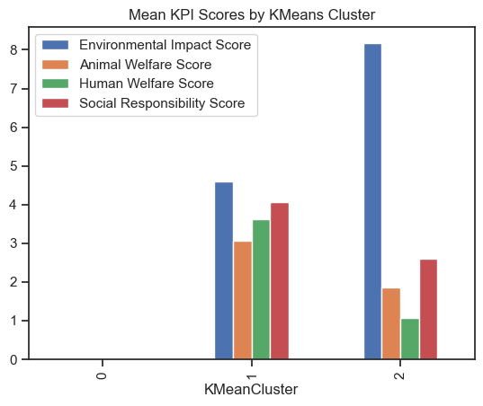

Nous observons trois clusters avec des caractéristiques distinctes :

- Cluster 0 : Ce cluster n'a aucune barre, ce qui signifie qu'il n'y a pas de données pour ce cluster. Par conséquent, ce cluster n'est pas utile pour notre analyse.

- Cluster 1 : Les quatre indicateurs suivants ont une valeur d'environ 4 : Score d'impact environnemental, Score de bien-être animal, Score de bien-être humain et Score de responsabilité sociale. Cela montre que les vêtements de ce groupe ont des performances moyennes dans tous les domaines.

- Cluster 2 : Ce cluster présente des scores plus bas pour les trois premiers indicateurs (environ 2) et un score d'impact environnemental élevé (environ 8). Cela indique que les vêtements de ce groupe ont un impact environnemental plus important, mais ont des performances plus faibles en termes de bien-être animal, de bien-être humain et de responsabilité sociale.

En conclusion, les clusters 1 et 2 sont utiles pour identifier les différences entre les vêtements en termes d'impact environnemental et de performance sociale. Le cluster 0, en revanche, ne semble pas utile puisqu'il ne contient pas de données. Ainsi, l'algorithme KMeans a réussi à séparer les vêtements en deux groupes distincts en fonction de leurs indicateurs clés de performance.

## DBSCAN ##

### PairPlot ###

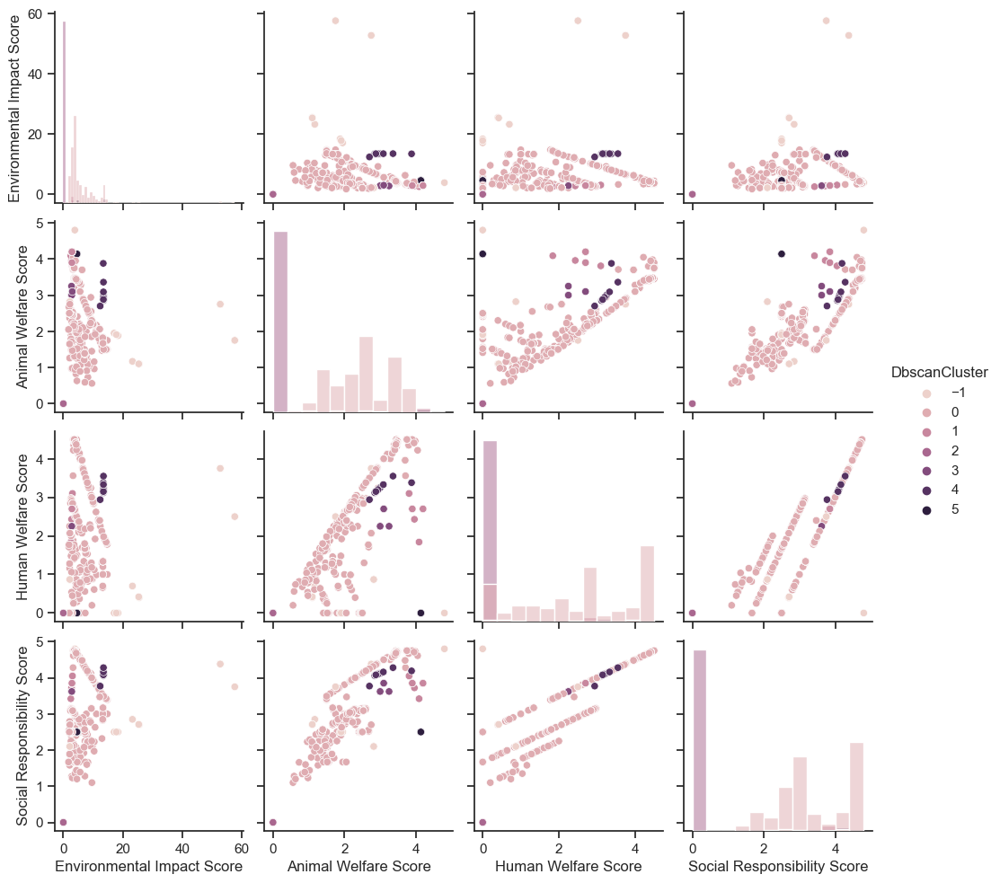

Dbscan a créé 7 classes, mais d'après les données fournies, nous ne pouvons observer que deux classes (0 et 1) et un point classifié comme bruit (-1). La majorité des points appartiennent à la classe 0, et seulement quelques-uns à la classe 1. Le point classifié comme bruit est très éloigné des autres points et semble être une anomalie.

En examinant les relations entre les variables, il semble que les scores environnementaux, animal, humain et social sont fortement liés les uns aux autres. En d'autres termes, les produits ayant un impact environnemental élevé ont également tendance à avoir un bien-être animal, humain et une responsabilité sociale élevés. La classe 1 semble avoir des scores légèrement inférieurs à ceux de la classe 0 dans toutes les dimensions.

En conclusion, les classes générées par Dbscan ne semblent pas être très utiles dans cet exemple, car elles ne montrent pas de différences significatives entre les groupes. La majorité des points appartiennent à une seule classe et les différences entre les classes 0 et 1 sont minimes. De plus, un seul point est considéré comme du bruit, ce qui indique que la méthode de clustering pourrait ne pas être la meilleure pour ce type de données. Il serait peut-être intéressant d'explorer d'autres méthodes de clustering ou de modifier les paramètres de Dbscan pour obtenir des résultats plus pertinents et exploitables.

### radar ###

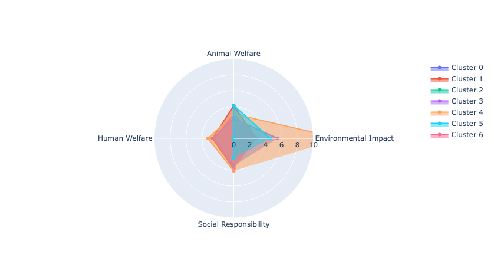

La majorité des classes montre des différences notables dans leurs scores, indiquant une certaine diversité entre les groupes. Cependant, certaines classes ont des scores très similaires, ce qui peut suggérer un chevauchement dans les caractéristiques des éléments appartenant à ces classes.

Les 7 classes générées par le clustering DBSCAN peuvent être utiles pour identifier des groupes ayant des caractéristiques différentes en termes d'impact environnemental, de bien-être animal, de bien-être humain et de responsabilité sociale. Toutefois, il serait intéressant d'étudier plus en détail les classes ayant des scores similaires, afin de déterminer s'il est nécessaire de les fusionner ou si elles représentent des groupes distincts malgré leurs ressemblances.

### Histogramme moyen ###

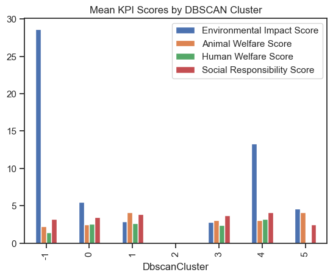

En résumé, voici les observations pour chaque classe :

- Classe -1 : Elle présente une valeur élevée pour l'impact environnemental (environ 28). Cela indique que les produits de cette classe ont un impact environnemental important.
- Classe 2 : Elle n'a pas de valeur, ce qui suggère que cette classe n'est pas utile pour notre analyse.
- Classe 4 : Elle présente une valeur modérée pour l'impact environnemental (environ 15). Les produits de cette classe ont un impact environnemental modéré.
- Classe 5 : Elle n'a pas de valeur pour le bien-être humain. Cela signifie que cette classe n'apporte pas d'informations pertinentes sur le bien-être humain.

En conclusion, les classes -1 et 4 sont utiles pour analyser l'impact environnemental des produits, avec des impacts respectivement élevés et modérés. Cependant, les classes 2 et 5 ne sont pas pertinentes pour l'analyse puisqu'elles ne fournissent pas d'informations sur les indicateurs étudiés. Il serait peut-être nécessaire de réévaluer le nombre de classes ou les paramètres de l'algorithme DBSCAN pour obtenir des résultats plus concluants.

## GaussianMixture

### PairPlot

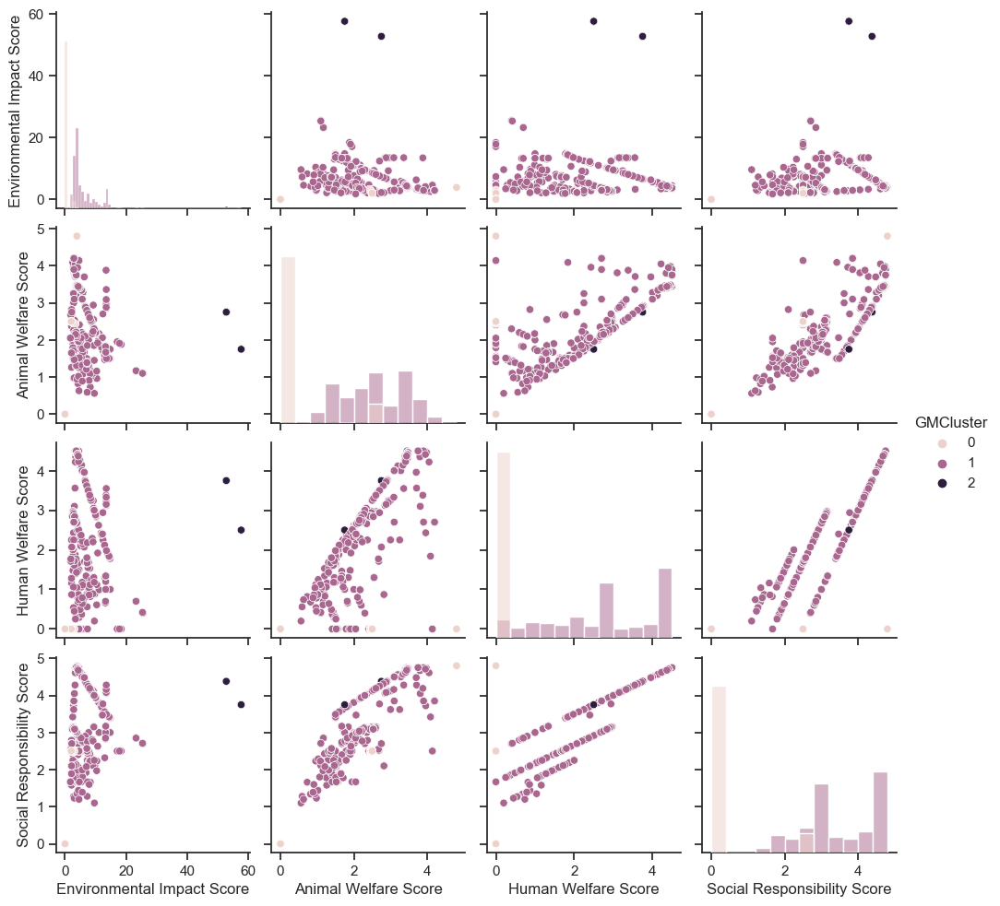

En analysant les données fournies, nous pouvons constater que le clustering GaussianMixture a créé 3 classes, mais les données fournies ne montrent qu'une seule classe (GMCluster = 1) très prédominante. Malgré cela, nous pouvons quand même analyser les relations entre les différentes variables de cette classe.

En observant les graphiques, on constate que les scores "Environmental Impact Score", "Animal Welfare Score", "Human Welfare Score" et "Social Responsibility Score" sont répartis en deux groupes distincts. Le premier groupe a des scores plus élevés pour toutes les variables, tandis que le second groupe a des scores plus faibles.

En conclusion, bien que les données fournies ne montrent qu'une seule classe trop prédominante et ne permettent pas d'évaluer directement l'utilité des classes créées par le clustering GaussianMixture, nous avons pu identifier deux groupes distincts à l'intérieur de cette classe en fonction des scores des différentes variables.

## Radar

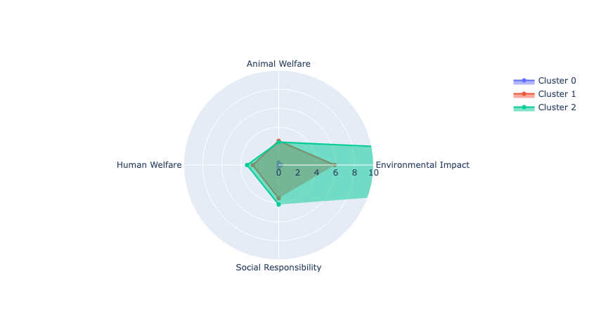

Comme expliqué précédemment, ce modèle ne propose rien d'intéressant à relever, mis à part le fait qu'une fois de plus, pour l'une des classes, le KPI environnement présente des valeurs démesurées.

### Histogramme moyen ###

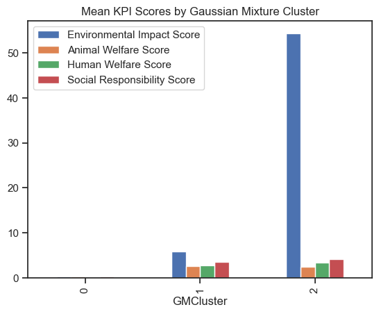

Le problème persiste avec le KPI Environnement, et il n'y a malheureusement aucune analyse intéressante à fournir. 

# Conclusion V0 #

À la lumière de l'analyse ci-dessus, on remarque que le modèle KMeans semble avoir les meilleurs résultats. Cependant, les paramètres de cette recherche ne sont pas satisfaisants et donc ne permettent pas une bonne comparaison des modèles.

Pour la prochaine analyse, je vais réduire le nombre de clusters pour KMeans et GM à deux et recalculer le KPI Environnement. Afin de ne pas manquer de faits intéressants, d'abord le KPI sera recalculé, puis je referai un audit. Si des choses intéressantes apparaissent, je verrai une analyse détaillée avant de réduire la dimension de mes clusters.

## Conclusion de la V0
Comme on pouvais s'en douter cette approche n'a pas apporté de resultat concré, c'est souvent le cas quand on decouvre les données. Cependent cette etape a été tres utile, elle ma permis de :
- Bien decouvrire mes données et comment travailler avec.
- Me confronter avec mon projet, ca faisabilité et la charge de travail a fournir.
- Construire un plan pour la V1 de mon projet

# Projet V2
## Plan d'attaque
1- Normalisation des KPI: Il faut absolument que tout mes KPI soit sur la meme plage afin de garder un jeux de données homogene
2- Annalise approfondi du dataset: Verifier et visulaisé mon jeux de données, ca me permetra de de choisir des modeles plus adapter et de potencielemnt trouvé des failles de fiabilité
3- Performence des modeles: Utilisé des techniques de mesure interne a mes cluster afin de pouvoir donné un score a chaque modeles.
4- Annalyse des clusters: Pour les x meillieures modeles, il faut que je fasse une visualisation addapter afin de comprendre ce que mes cluster exprime.
Au travail !

### 1- Amélioration des KPI

Les KPI initiaux présentaient des problèmes d'échelle, avec certains indicateurs pouvant atteindre des valeurs maximales de 50 tandis que d'autres ne dépassaient pas 1. Cette différence d'échelle pourrait entraîner des problèmes lors de l'utilisation de ces KPI pour le clustering non supervisé, car certains indicateurs pourraient dominer les autres. Pour résoudre ce problème, nous avons normalisé les KPI afin qu'ils se situent tous dans une plage similaire, par exemple entre 0 et 10.

Logique et mathématiques des KPI: 

Pour normaliser les KPI, nous avons utilisé la formule suivante:

`valeur_normalisée = valeur_min_nouvelle_plage + ((valeur - valeur_min_ancienne_plage) * (valeur_max_nouvelle_plage - valeur_min_nouvelle_plage)) / (valeur_max_ancienne_plage - valeur_min_ancienne_plage)`

Cette formule permet de transformer une valeur dans l'ancienne plage de valeurs en une valeur équivalente dans la nouvelle plage. Les minimums et maximums des plages de valeurs pour chaque KPI doivent être définis en fonction des données.

Ainsi, les KPI normalisés ont été calculés comme suit:

- Score d'impact environnemental : moyenne de l'utilisation d'eau, de l'énergie fossile, des émissions de gaz à effet de serre et de l'utilisation des terres par kg de matériau, puis normalisé entre 0 et 10.
- Score de bien-être animal : valeur du bien-être animal, puis normalisé entre 0 et 10.
- Score de bien-être humain : valeur du bien-être humain, puis normalisé entre 0 et 10.
- Score de responsabilité sociale : moyenne du score de bien-être humain et d'une valeur de 1 si les conditions de travail sont dangereuses ou de 10 si elles sont sûres, a ca est ponderé le bien etre humain puis normalisé entre 0 et 10.

### 2- Annalyse appronfondie du dataset
Maintenat que nous avont des KPI coerant et que vous avont bien compris nos données grace a la V0 il est temps de rentré dans le detail afin de verifier que le datase est pret a la modelisation et d'essayer de trouvé des modeles coherent avec nos donnée.

Avant de visualisé ce dataset, il faut savoire qu'il a une tres forte dimentionalité (nommbre de variables/colones) ce qui rend plus difficila ca comprehension.
Afin de paller a ce probleme, nous avont plusieur solution, la premieres et d'utilis;e des graphique addapté telle que la visualisation en `coordonees parralelle` ou des `matrice de correlation` qui permet de suivre l'evolution de nos variable et utilisé des technique de reduction dimentionels. Nous allon faire les deux.
- `Matrice de correlation`:
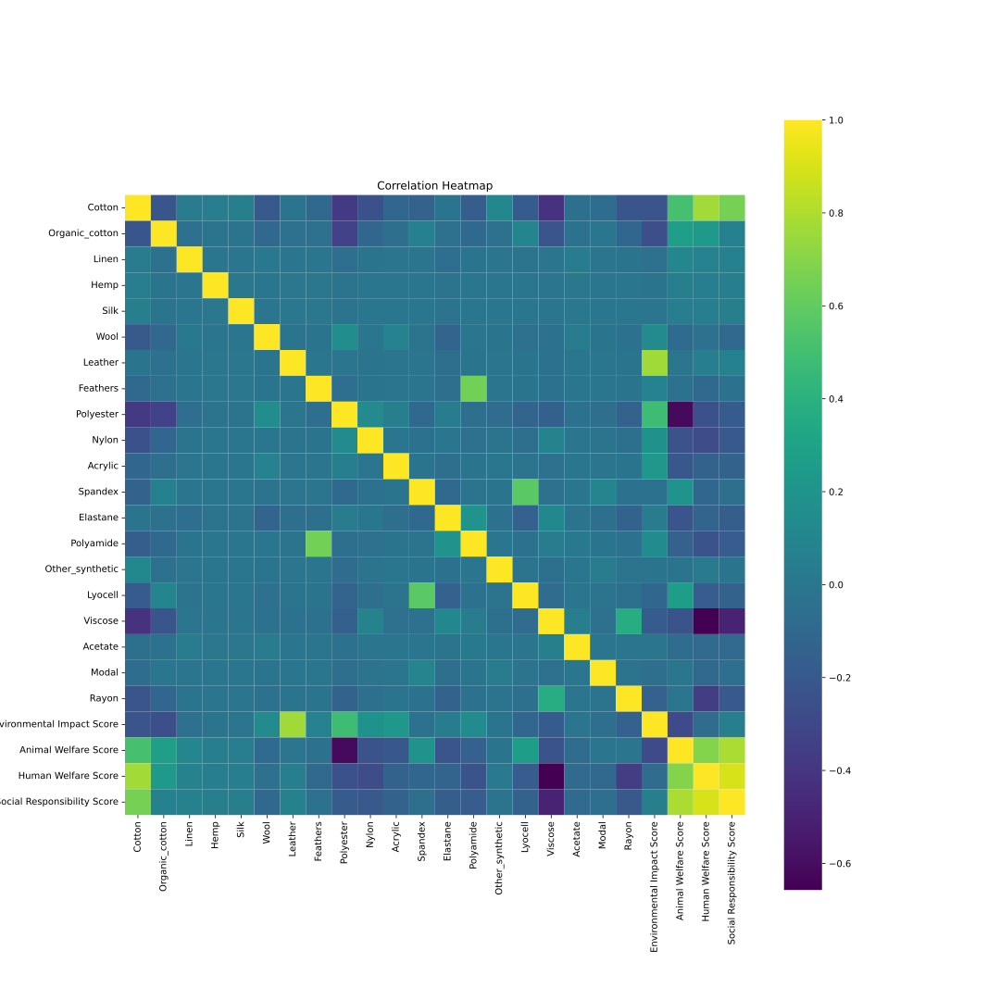
On remarque directement que certaine variable sont corréle. Notament le `Cotton` qui est en lien directe avec avec nos nos KPI "social". On remarque aussi un corrélation assez élevé entre nos KPIs, ce qui est logique car ils reflete tous diferente aspect d'une meme chose. Cependant leures correlation est suffisament faible pour que nous puissions les utilisé ensemble.

- `parallel coordinates`:
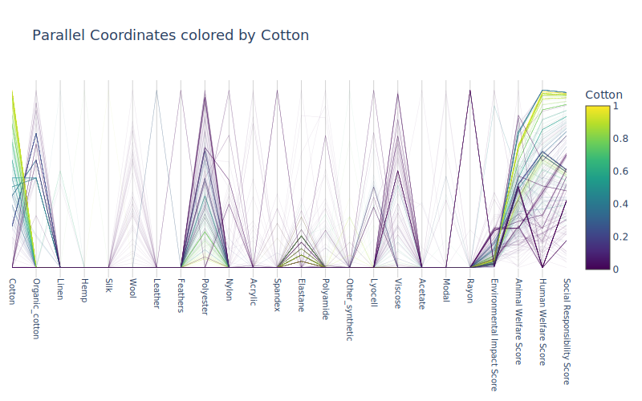
En annalysant ce graphique on remarque plusieurs choses, notament que cetaine varible n'ont pas trop d'importence comme `Hemp` et on remaque aussi qu'un `Cotton` elevé tend a des KPIs elevé.

On peux aussi regarder le graphique colorié en fonction de nos KPIs, par exemple, si on regarde pour `social Responsibility Score`:
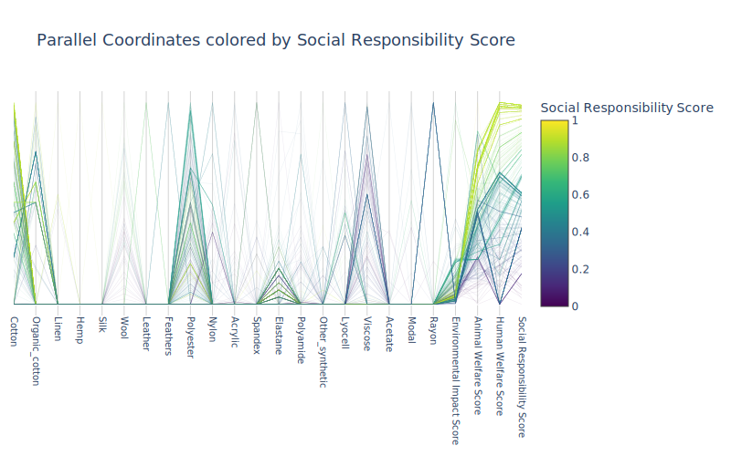
On remaque que les vetements comportant un fort taux de `Viscose` ont un `social Responsibility Score` faible. Ce qui est logique car la viscose est matière chimique artificielle fabriquée à base de bois gras réduit en copeaux ou de pâte de bois trempé dans de la soude. Donc ayant un impact social important car les condition de travail avec de tell matieres sont mauvaise.

Vous trouverais les graphique pour chaque variables dans le dossier `images/parallel` de ce repo.